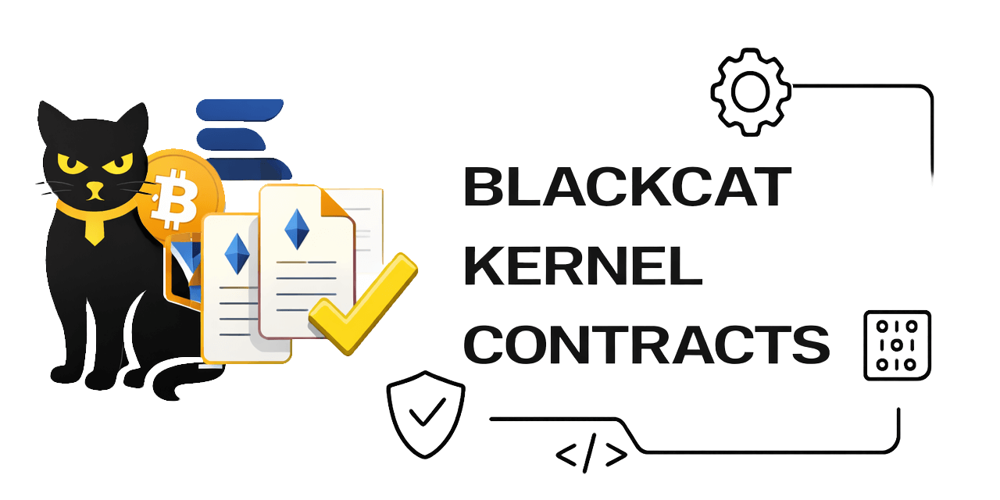

# BlackCat Kernel Contracts

[](https://github.com/blackcatacademy/blackcat-kernel-contracts/actions/workflows/ci.yml?query=branch%3Amain)
[](https://github.com/blackcatacademy/blackcat-kernel-contracts/actions/workflows/slither.yml?query=branch%3Amain)

EVM smart contracts that act as the **trust authority** for BlackCat installations.

The core idea:
- every BlackCat install gets its own on-chain **Instance Controller** contract (clone/proxy),
- the contract stores the attested integrity state (install + upgrades) and emergency controls,
- the runtime (via `blackcat-core` + `blackcat-config`) treats the on-chain state as the source of truth and fails closed in production when trust cannot be verified.

This repository is intentionally **Solidity-only**. Runtime policy, config permission checks, and CLI/installer flows live in other repos.

## Contracts

- [`ReleaseRegistry`](src/ReleaseRegistry.sol): global registry of “official” component releases (version → root hash + URI).
- [`InstanceFactory`](src/InstanceFactory.sol): creates/clones `InstanceController` per install and runs the setup ceremony (CREATE + CREATE2).
- [`InstanceController`](src/InstanceController.sol): per-install state machine (propose → stage → activate upgrades), pause/unpause, and history events.
- [`KernelAuthority`](src/KernelAuthority.sol) (optional): minimal EIP-712 threshold signer authority (multi-device by design without Safe dependency).
- [`ManifestStore`](src/ManifestStore.sol) (optional): append-only on-chain blob store for manifests (“full detail” mode availability).
- [`AuditCommitmentHub`](src/AuditCommitmentHub.sol) (optional): commits batched audit Merkle roots (event hub) with EIP-1271 reporter signatures.

## Docs

| Document | What it covers |
|---|---|
| [SPEC](docs/SPEC.md) | On-chain structures and invariants |
| [SECURITY_FLOWS](docs/SECURITY_FLOWS.md) | Diagram-first flows (Mermaid) |
| [THREAT_MODEL](docs/THREAT_MODEL.md) | Threat model + assumptions |
| [POLICY_ENFORCEMENT](docs/POLICY_ENFORCEMENT.md) | Runtime PEP (“Back Controller”) design |
| [AUTHORITY_MODES](docs/AUTHORITY_MODES.md) | Safe vs `KernelAuthority` vs EOA |
| [OPERATIONS](docs/OPERATIONS.md) | Operational flows (bots, incidents, upgrades) |
| [BUILD_AND_VERIFICATION](docs/BUILD_AND_VERIFICATION.md) | Build settings, EIP-170 size notes, metadata/verification portability |
| [DRY_RUN_EDGEN](docs/DRY_RUN_EDGEN.md) | Step-by-step Edgen dry-run (no broadcast) |
| [DRY_RUN_EDGEN_KERNELAUTHORITY](docs/DRY_RUN_EDGEN_KERNELAUTHORITY.md) | Same, but using `KernelAuthority` |
| [DEPLOY_EDGEN](docs/DEPLOY_EDGEN.md) | Edgen Chain dry-run + broadcast deployment |
| [VERIFY_EDGENSCAN](docs/VERIFY_EDGENSCAN.md) | Explorer verification (decode method names) |
| [AUDIT_CHECKLIST](docs/AUDIT_CHECKLIST.md) | Practical pre-production checklist |
| [AUDIT_REPORT](docs/AUDIT_REPORT.md) | Internal audit notes + fixes |
| [TEST_REPORT](docs/TEST_REPORT.md) | What the Foundry test suite validates |
| [TEST_MATRIX](docs/TEST_MATRIX.md) | External/public API → test mapping |
| [AUDIT_COMMITMENTS](docs/AUDIT_COMMITMENTS.md) | Optional audit Merkle root commitments |
| [ROADMAP](docs/ROADMAP.md) | Planned work |

Example deployment reports:
- [EDGEN_SMOKE_REPORT_2025-12-26](docs/EDGEN_SMOKE_REPORT_2025-12-26.md)
- [EDGEN_VERIFICATION_REPORT_2025-12-26](docs/EDGEN_VERIFICATION_REPORT_2025-12-26.md)

## Governance model

Do not embed complex multisig logic inside these contracts. Prefer external multisig wallets (e.g. Safe) and treat them as authorities:
- `root_authority` (policy changes, signer rotation, thresholds)
- `upgrade_authority` (propose/activate upgrades)
- `emergency_authority` (pause/unpause / emergency gates)

In practice each authority can be a separate Safe with its own threshold.

## Trust modes

- `root+uri` (recommended baseline): store a Merkle/tree root plus a content URI (IPFS/HTTPS) for full manifests.
- `full detail` (paranoid): store more on-chain detail (chunked manifest bytes or per-file hashes). Expensive; only for high-value systems.

## Tooling

Dev stack: Foundry (`forge`).

Run via Docker (recommended for consistent solc/forge versions):

```bash
export FOUNDRY_IMAGE="${FOUNDRY_IMAGE:-ghcr.io/foundry-rs/foundry:stable}"

docker run --rm -v "$PWD":/app -w /app --entrypoint forge "$FOUNDRY_IMAGE" fmt
docker run --rm -v "$PWD":/app -w /app --entrypoint forge "$FOUNDRY_IMAGE" test --via-ir
```

## Deployment (Foundry)

Scripts live in [`script/`](script/) and intentionally avoid external dependencies.

For a complete operator-oriented guide (including authority rotation, guard/bot helpers, and production finalization), see: [OPERATIONS](docs/OPERATIONS.md).

- Deploy: [DeployAll.s.sol](script/DeployAll.s.sol), [DeployReleaseRegistry.s.sol](script/DeployReleaseRegistry.s.sol), [DeployInstanceFactory.s.sol](script/DeployInstanceFactory.s.sol), [DeployManifestStore.s.sol](script/DeployManifestStore.s.sol)
- Release publishing: [PublishRelease.s.sol](script/PublishRelease.s.sol), [PublishReleaseAuthorized.s.sol](script/PublishReleaseAuthorized.s.sol), [PublishReleaseBatchAuthorized.s.sol](script/PublishReleaseBatchAuthorized.s.sol)
- Release revocation: [RevokeRelease.s.sol](script/RevokeRelease.s.sol), [RevokeReleaseAuthorized.s.sol](script/RevokeReleaseAuthorized.s.sol), [RevokeReleaseBatchAuthorized.s.sol](script/RevokeReleaseBatchAuthorized.s.sol), [RevokeByRootAuthorized.s.sol](script/RevokeByRootAuthorized.s.sol)
- Instances + upgrades: [CreateInstanceDeterministic.s.sol](script/CreateInstanceDeterministic.s.sol), [ProposeUpgrade.s.sol](script/ProposeUpgrade.s.sol), [ProposeUpgradeByRelease.s.sol](script/ProposeUpgradeByRelease.s.sol), [ActivateUpgradeExpected.s.sol](script/ActivateUpgradeExpected.s.sol), [CancelUpgradeExpected.s.sol](script/CancelUpgradeExpected.s.sol), [FinalizeProduction.s.sol](script/FinalizeProduction.s.sol)
- Monitoring + incidents: [CheckIn.s.sol](script/CheckIn.s.sol), [ReportIncident.s.sol](script/ReportIncident.s.sol), [PauseIfStale.s.sol](script/PauseIfStale.s.sol), [PauseIfActiveRootUntrusted.s.sol](script/PauseIfActiveRootUntrusted.s.sol)
- Attestations: [SetAttestation.s.sol](script/SetAttestation.s.sol), [ClearAttestation.s.sol](script/ClearAttestation.s.sol), [SetAttestationAndLock.s.sol](script/SetAttestationAndLock.s.sol), [LockAttestationKey.s.sol](script/LockAttestationKey.s.sol)
- Manifest blobs: [UploadManifestBlob.s.sol](script/UploadManifestBlob.s.sol)
- Audit commitments (optional): [DeployAuditCommitmentHub.s.sol](script/DeployAuditCommitmentHub.s.sol), [PostAuditCommit.s.sol](script/PostAuditCommit.s.sol)

**Security status (2026-01-02):** not independently audited yet. Continuous checks: Foundry tests + Slither (High/Medium=0) + rotating AI audits (daily). Internal “production candidate” target: **2026-02-01** (conditional). See: [SECURITY_STATUS](docs/SECURITY_STATUS.md).
