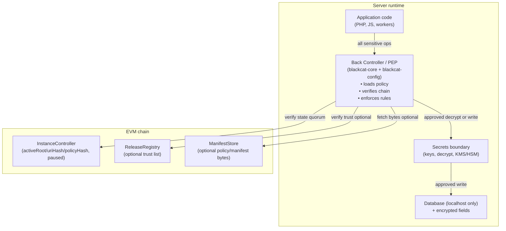
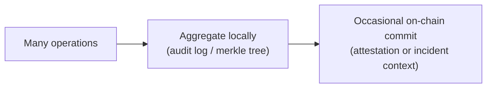

# Policy Enforcement (“Back Controller”) — Design Notes (Draft)

This document explains how BlackCat enforces *runtime rules* (“what is allowed to happen”) using:
- on-chain **commitments** (`activeRoot`, `activeUriHash`, `activePolicyHash`) stored in `InstanceController`, and
- off-chain **policy enforcement** in `blackcat-core` + `blackcat-config`.

Important:
- Contracts cannot directly “sandbox” a server. They provide a **trust anchor** and an audit trail.
- Enforcing “you must not call X” happens **off-chain**, by ensuring sensitive operations can only succeed when the runtime’s policy checks pass.

Related:
- [SPEC](SPEC.md)
- [SECURITY_FLOWS](SECURITY_FLOWS.md)
- [THREAT_MODEL](THREAT_MODEL.md)

## What the chain stores vs what the runtime enforces

**On-chain (truth):**
- which integrity state is accepted now (`activeRoot`, `activeUriHash`, `activePolicyHash`)
- whether the install is paused (`paused`)
- what upgrade (if any) is pending and when it can be activated
- optional: compatibility rollback window and attestations (pinned hashes / pointers)

**Off-chain (enforcement):**
- *how* to compute `observedRoot` from local files
- *how* to fetch/validate policy bytes (from local cache, URI, or `ManifestStore`)
- *how* to block unsafe writes in production (fail closed)
- *how* to apply fine-grained rules to sensitive operations (DB writes, decryptions, key rotations)

## The “Back Controller” in BlackCat terms

The “back controller” is a classic **Policy Enforcement Point (PEP)**:
- All security-critical actions must go through a single enforcement layer (a narrow API).
- That layer checks the current on-chain commitments and the active policy before allowing the action.

### Non-negotiable design rule

If a secret (or a privileged capability) is reachable by *any other* code path than the PEP, then a local attacker can bypass your policy.

So the ecosystem must aim for:
- **single path to secrets** (decrypt, key derivation, signing, encryption ingress),
- **single path to privileged writes** (tables/fields that must be protected),
- minimal exposed “escape hatches”.

## Policy anchoring: `activePolicyHash`

`activePolicyHash` is the on-chain commitment to the runtime rule set for the current active state.

Practical meaning:
- the runtime computes `observedPolicyHash` from the policy bytes it is enforcing,
- it compares it against `activePolicyHash` from `InstanceController`,
- mismatch means the policy on disk (or fetched) was tampered with → **deny security-critical writes** in production.

Where policy bytes come from (tiered):
1. Local cache (fast) + verified by hash.
2. Fetch by URI (IPFS/HTTPS) and verify by `uriHash` + `root`.
3. Optional: fetch from `ManifestStore` (availability-on-chain) and verify by hash.

## Enforcement points (what should be gated)

The PEP should be the only place that allows the following categories:

1. **Security-critical DB writes**
   - writes to encrypted tables/columns
   - writes that change crypto routing, key versions, encryption maps
2. **Decryption / key usage**
   - decrypt operations (AEAD open), KMS unwrap, HMAC key access
   - key rotation and “retire” transitions
3. **Install/upgrade mutations**
   - applying migrations or enabling new component roots
4. **Policy mutations**
   - changing runtime policy files/config (must be signed/pinned)

Not everything needs on-chain confirmation per call. The **default** should be:
- verify on-chain state at boot and periodically (quorum),
- block actions when state is unverified or mismatched.

## “Per-request on-chain write” is usually not the right tradeoff

It is possible to submit a transaction for every important write, but it is expensive and can become an availability DoS vector.

Recommended model:
- **many requests → one periodic check-in**
- **incidents / upgrades → on-chain events**
- optional: **batch commitments** (Merkle roots) for high-assurance audit trails

## Preventing “call bypass” attacks (what works, what doesn’t)

### What works

- Make the PEP the only owner/holder of secrets:
  - keys are never present as plain files readable by the web process,
  - keys come from HSM/KMS or from a locked-down local service accessible only to the PEP.
- Restrict capabilities by **process boundary**:
  - run crypto/key operations in a separate process/container with strict ACLs,
  - the app can only call it through an authenticated local channel.
- Use `paused` as a global “kill switch”:
  - runtime refuses writes while paused,
  - incident reports can pause the instance quickly.

### What does not work alone

- Only storing rules on-chain without enforcement:
  - chain can’t stop local code from ignoring it.
- “Database is localhost only”:
  - it blocks remote network attackers, but a local RCE can still reach localhost.

## blackcat-config integration points

`blackcat-config` is part of the enforcement story:
- selects a secure runtime config location (best available on the current OS/filesystem),
- enforces “no world-writable config” and detects tamper attempts,
- provides a single API for reading security-critical settings (no raw env parsing),
- supports dev vs production posture (warn vs fail-closed).

The PEP uses `blackcat-config` to decide:
- where the pinned controller address lives,
- how RPC quorum is configured,
- whether writes must be blocked when chain is unreachable.

## Contract-level guardrails (implemented)

- Optional staleness safety: `maxCheckInAgeSec` + `pauseIfStale()` to enforce monitoring freshness.
- Optional registry safety: `pauseIfActiveRootUntrusted()` to auto-pause if the current active root becomes revoked/untrusted in `ReleaseRegistry`.

## Suggested next contract-level extensions (future work)

These are intentionally *not required for v1 deployment*, but they match the “maximum security tiers” direction:

1. **Policy availability pinning**
   - store policy bytes in `ManifestStore` and reference them by `policyHash`.
2. **Audit root attestation**
   - standardize an attestation key (e.g., `keccak256("audit.merkle_root")`) for periodic audit commits.

## Production posture (summary)

Production should be strict:
- no bypass flags
- fail closed on trust uncertainty
- quorum RPC reads (2/3 or 2/2)
- secrets behind the PEP boundary (ideally HSM/KMS)

Development can be more permissive:
- warn + record incidents
- allow local iteration without hard shutdown
