# Security Flows & Diagrams (Draft)

This document provides **diagram-first** explanations of the Trust Kernel security flows:
what is expected to happen, what must *not* happen, and what the contracts enforce on-chain.

Diagrams use **Mermaid** (rendered by GitHub).

Important:
- These contracts are **not audited**.
- Off-chain enforcement (fail-closed runtime behavior, multi-RPC quorum, filesystem hardening) lives in `blackcat-core` + `blackcat-config`.

## Component Map

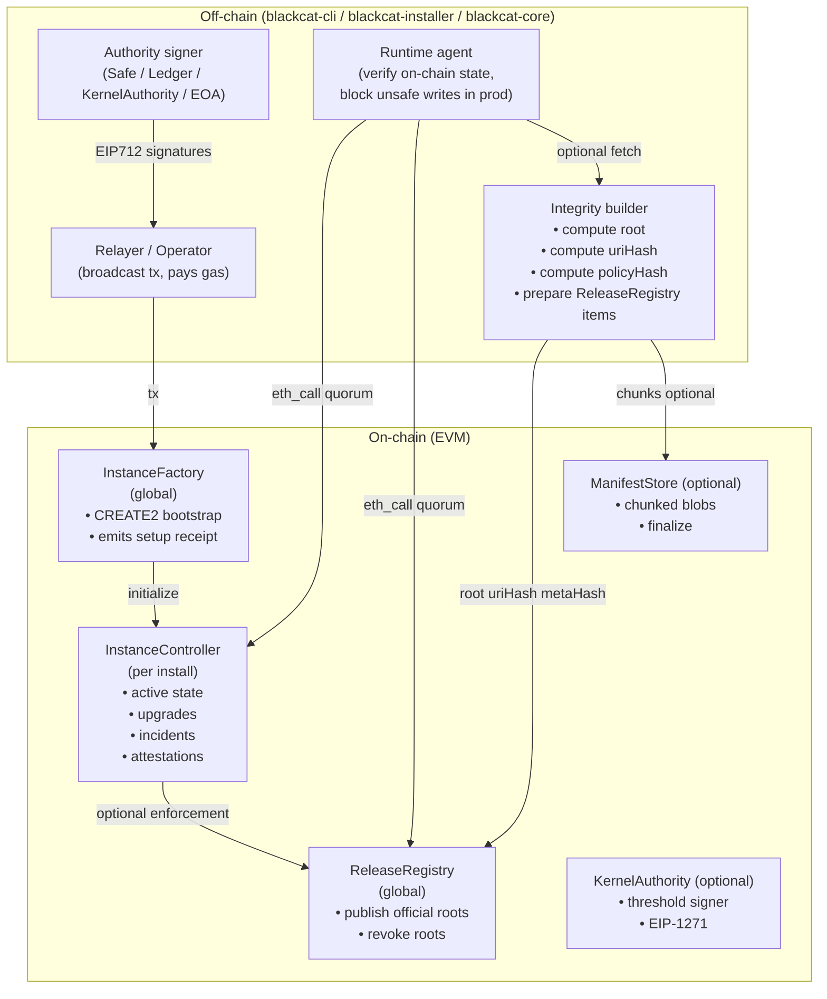

## Common Pattern: EIP-712 Digest + Anti-Replay

Most “relayer” flows follow the same pattern:

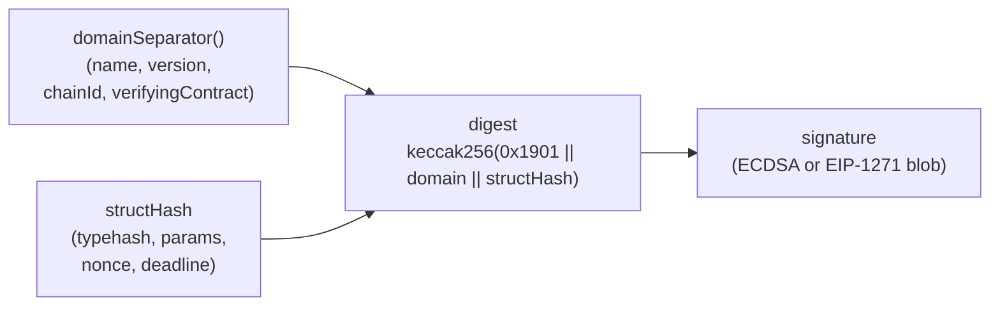

Properties:
- **Cross-chain replay resistance**: `chainId` is part of the domain separator.
- **Cross-contract replay resistance**: `verifyingContract` is part of the domain separator.
- **Intra-contract replay resistance**: nonces are included in the struct.
- **Time-bounded signatures**: `deadline` bounds signature validity.

## Flow: Runtime Policy Enforcement (“Back Controller” / PEP)

The Trust Kernel cannot “sandbox” a server by itself. Instead:
- `InstanceController` stores the *commitments* (what must be true),
- the runtime enforces the policy (what is allowed to happen) and fails closed in production.

See also: [POLICY_ENFORCEMENT](POLICY_ENFORCEMENT.md).

### Boot sequence (production posture)

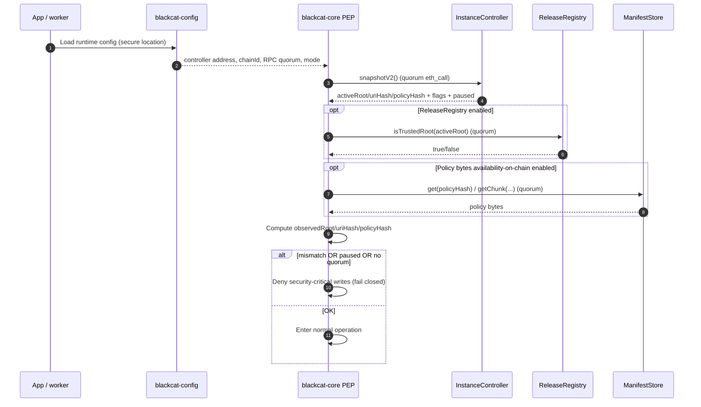

### Per-request enforcement (high level)

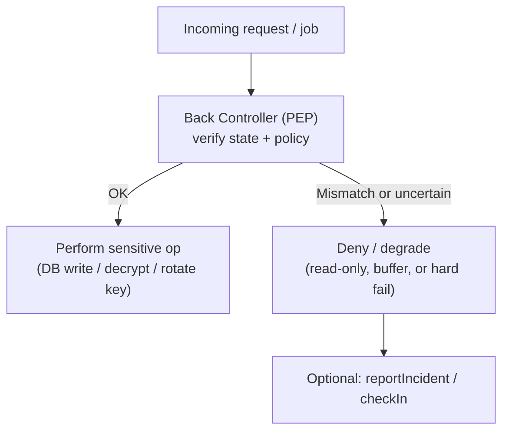

Expected:
- Sensitive operations are only reachable through the enforcement layer.
- Production does not “continue anyway” when trust cannot be verified.

Forbidden:
- Bypassing the enforcement layer by calling lower-level primitives directly (design must avoid exposing secrets outside PEP).

## Trust Modes: `root+uri` vs “full detail”

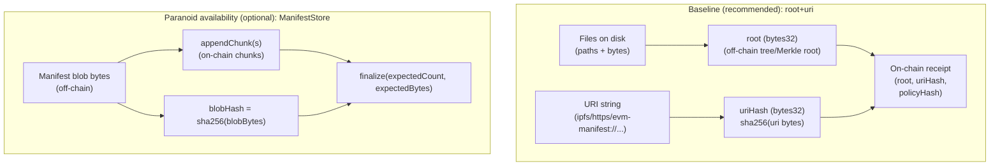

Expected:
- The on-chain system stores **hashes**, not full manifests (unless you enable `ManifestStore` for availability).
- Consumers **verify** off-chain content against the on-chain root/uriHash.

Forbidden:
- Treating any off-chain URI as “trusted” without verifying it matches the on-chain `uriHash` and `root`.

## Flow: Publish Official Releases (ReleaseRegistry)

### Happy path (owner or relayer)

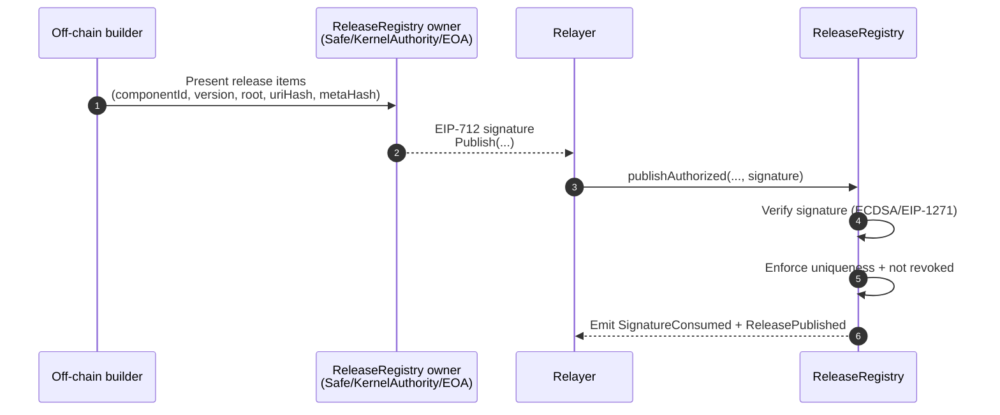

Key on-chain checks:
- `root` cannot be republished under a different `(componentId, version)` (uniqueness via `rootIndex`).
- `(componentId, version)` is immutable once published.
- Revoked roots cannot be republished.

### Batch publishing

For batch operations, signatures cover `itemsHash = keccak256(abi.encode(items))` where
`items` is an array of structs (`PublishBatchItem[]`).

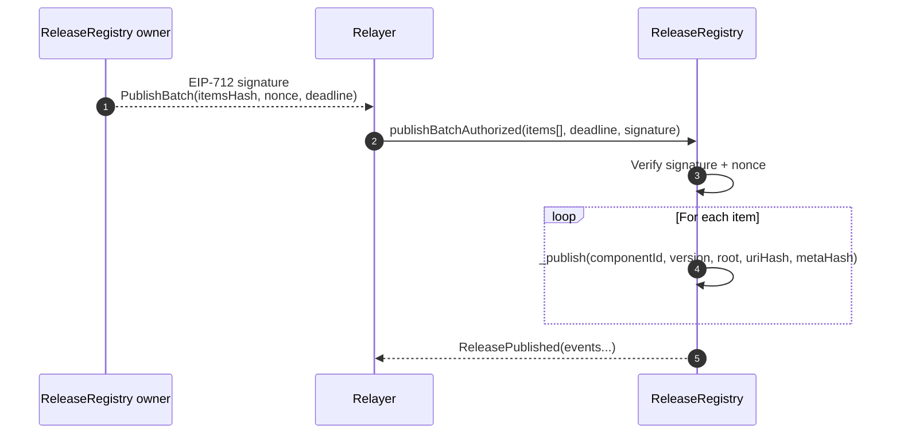

### Revocation

Expected:
- Revocation is permanent: a revoked root becomes **untrusted**.

Forbidden:
- Activating an upgrade/root that is revoked (controllers enforce this if `releaseRegistry != 0`).

## Flow: Per-Install Bootstrap (InstanceFactory + CREATE2)

Goal: deterministic deployment (predictable address) **without** letting third parties pre-claim salts.

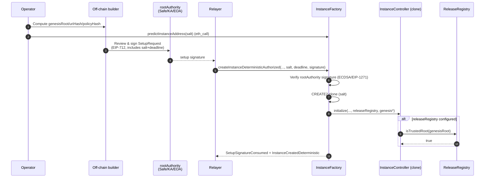

Expected:
- `salt` is bound into the signed digest, preventing signature replay into other instance addresses.
- If `releaseRegistry` is configured, genesis must already be published and trusted.

Forbidden:
- Anyone deploying a deterministic instance without a rootAuthority signature.
- Reusing the same `(salt, factory)` to create a second instance (CREATE2 will fail).

## Flow: Upgrades (InstanceController)

### Upgrade state machine (conceptual)

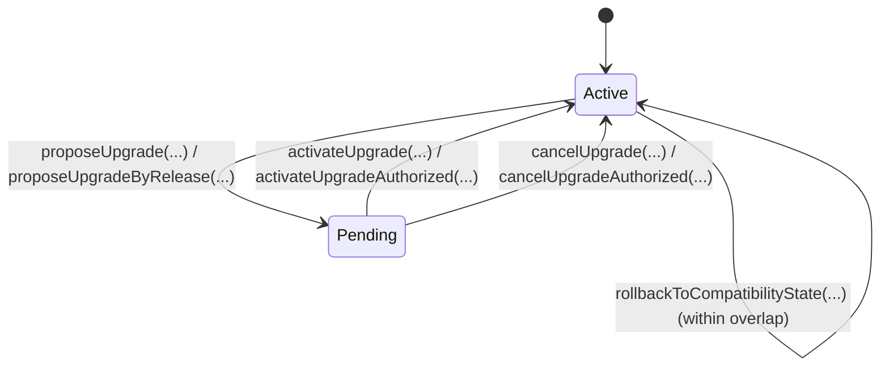

### Propose → Activate (with registry enforcement)

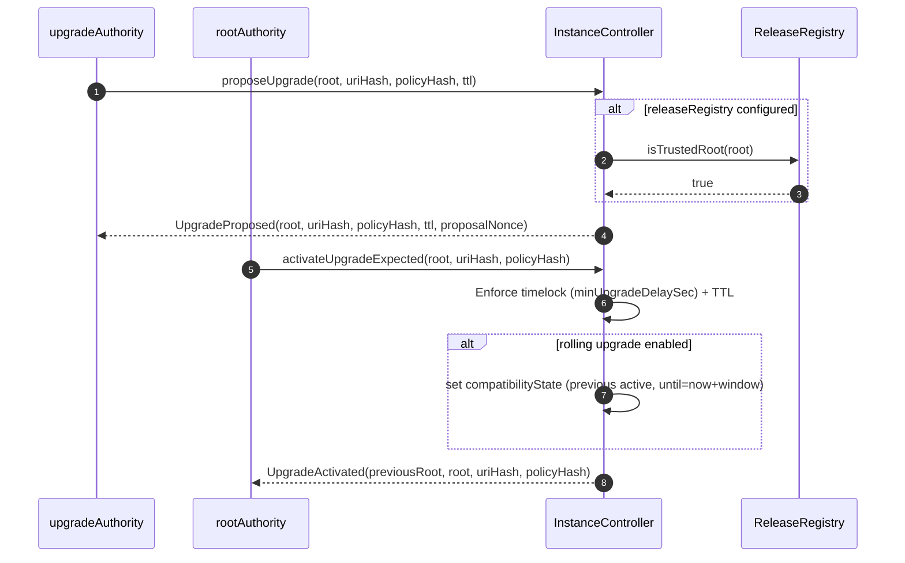

Expected:
- Propose is separated from activate (review window).
- Activation is root-controlled; relayer variants use EIP-712 + nonces.

Forbidden:
- Activating a root that is not trusted by `ReleaseRegistry` (when configured).
- Replaying old “activate” signatures after a new proposal (`pendingUpgradeNonce` prevents this).

### Paused upgrades (incident recovery)

`InstanceController` allows upgrades to be activated while `paused=true` to support incident recovery workflows.
Runtime policy (off-chain) decides what actions are permitted while paused.

## Flow: Incidents, Check-ins, Auto-Pause

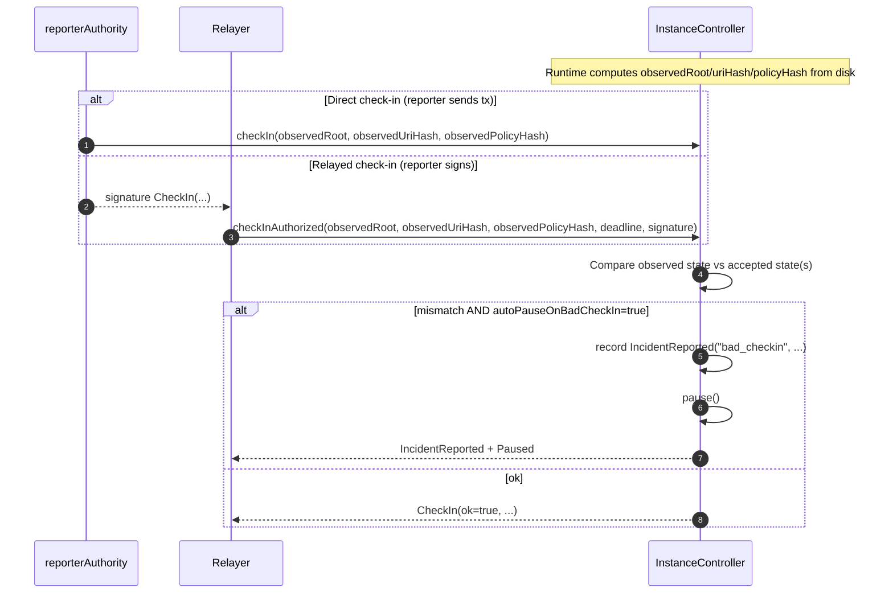

Expected:
- Check-ins are reporter-controlled (direct) or reporter-signed (relayed).
- A “bad check-in” can pause the controller if configured, creating an on-chain incident record.

Forbidden:
- Allowing an untrusted process to act as `reporterAuthority`.

### Permissionless auto-pause helpers (bots)

These helpers are intended for monitoring/guard bots. They are permissionless by design and are safe because they can only reduce availability (pause), not grant new authority.

#### `pauseIfStale()` (check-in freshness)

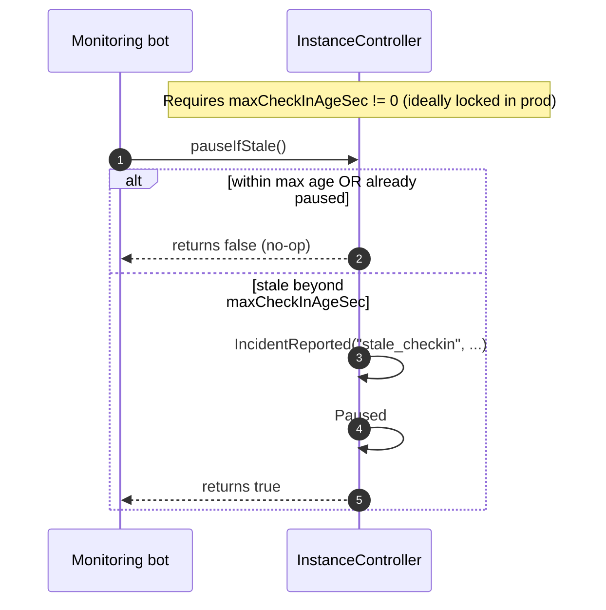

#### `pauseIfActiveRootUntrusted()` (registry revocation)

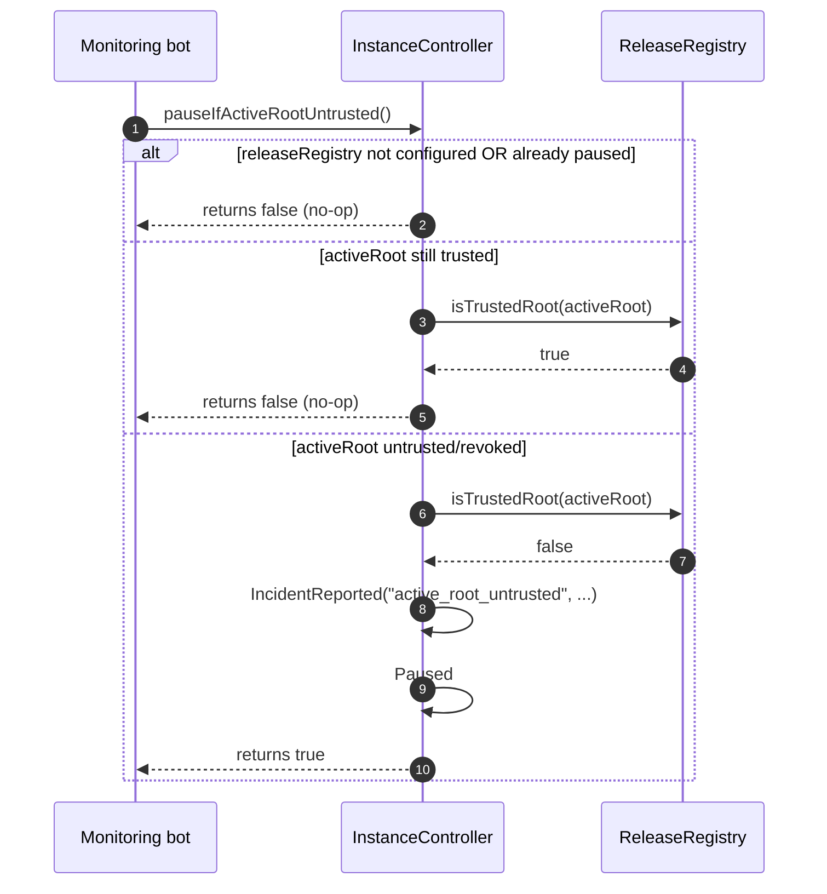

## Flow: Authority Rotation (2-step, optional relayer)

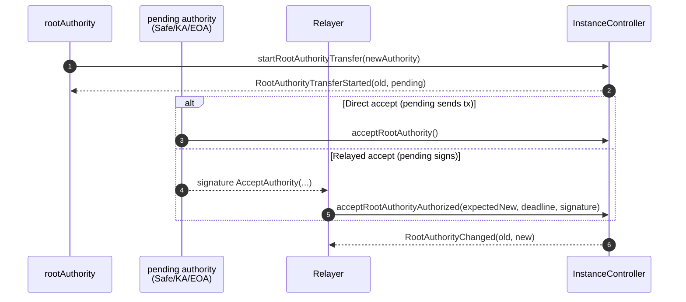

Expected:
- Two-step transfers reduce operator mistakes.
- Relayed accepts allow “air-gapped” authorities to approve without sending the tx.

Forbidden:
- Single-step reassignment without a pending accept (not supported by design).

## Flow: Attestations (pinning extra trust anchors)

Attestations are generic `key -> value` slots (root-controlled) used to pin extra integrity facts on-chain (e.g. runtime config hash).

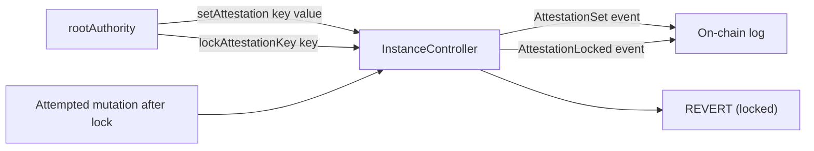

Expected:
- Long-lived trust anchors should be write-once (lock after setting).

Forbidden:
- Treating mutable attestations as immutable evidence.

## Flow: Runtime config hardening (blackcat-config + attestations)

Goal: prevent an attacker with filesystem write access from “redirecting” the runtime
(different chain/RPC/controller address, disabling strict checks, changing quorum, etc.).

Recommended pattern:
1. `blackcat-config` generates a **file-based** runtime config in the safest available location for the current host.
2. `rootAuthority` pins the config hash on-chain using an attestation key and locks it.
3. `blackcat-core` fails closed if the local runtime config does not match the pinned hash.

### Diagram: choosing the safest runtime config location

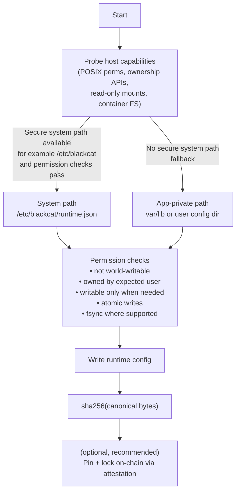

Expected:
- The runtime config must be **file-based**, not env-based, for security-critical settings.
- Permission checks must be strict (fail closed if not verifiable).

Forbidden:
- Reading `chain_id`, `rpc_endpoints`, or contract addresses from env in production.
- Writing runtime config to a world-writable path (or accepting it if already there).

### Diagram: pinning runtime config hash on-chain

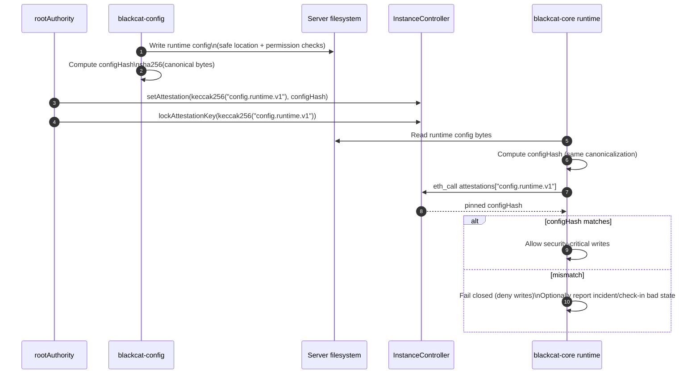

## “Must Never Happen” (high-level invariants)

| Area | Invariant | Enforced by |
|---|---|---|
| Setup | Unauthorized CREATE2 instance creation | `InstanceFactory.createInstanceDeterministicAuthorized` |
| Releases | Root reuse across different releases | `ReleaseRegistry.rootIndex` |
| Releases | Publishing revoked root | `ReleaseRegistry.revokedRoots` |
| Controller | Activate without root authority | access control + signature checks |
| Controller | Replay activate/cancel/pause signatures | nonces + domain separator |
| Controller | Upgrade to untrusted root (if registry set) | `isTrustedRoot(...)` checks |
| Controller | Mutate locked settings/attestations | lock flags |

## Suggested “audit evidence” to monitor (events)

| Contract | Events worth monitoring |
|---|---|
| `ReleaseRegistry` | `ReleasePublished`, `ReleaseRevoked`, `SignatureConsumed`, ownership events |
| `InstanceFactory` | `SetupSignatureConsumed`, `InstanceCreatedDeterministic` |
| `InstanceController` | `UpgradeProposed`, `UpgradeActivated`, `Paused/Unpaused`, `IncidentReported`, `AuthoritySignatureConsumed`, lock events |
| `ManifestStore` | `ChunkAppended`, `BlobFinalized` |
| `KernelAuthority` | `Executed`, `BatchExecuted`, `ConfigChanged` |
