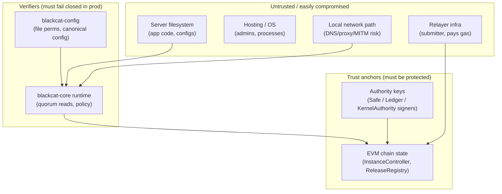
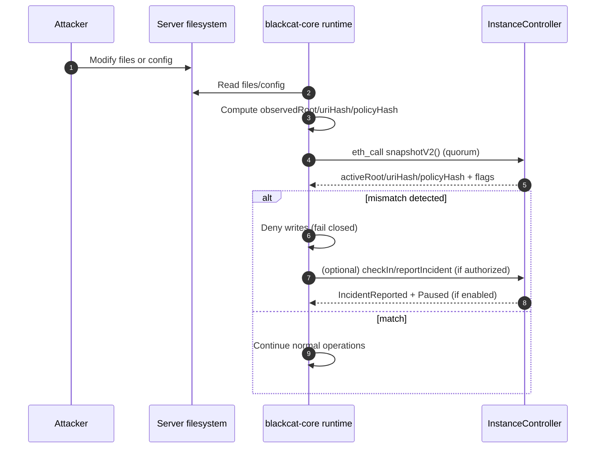
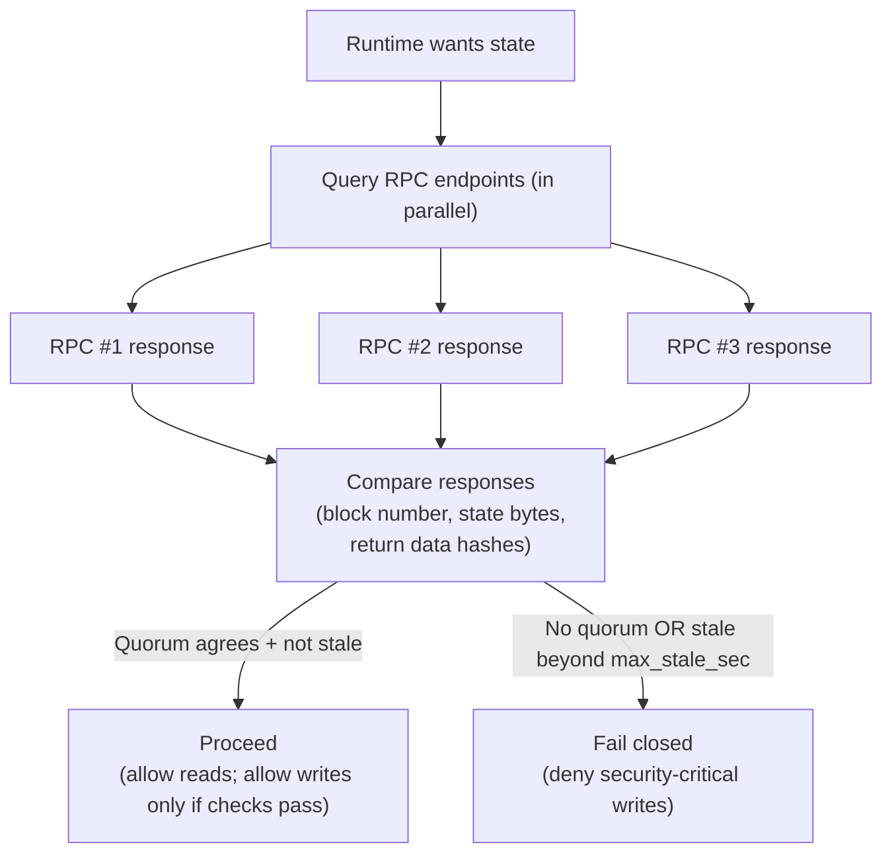
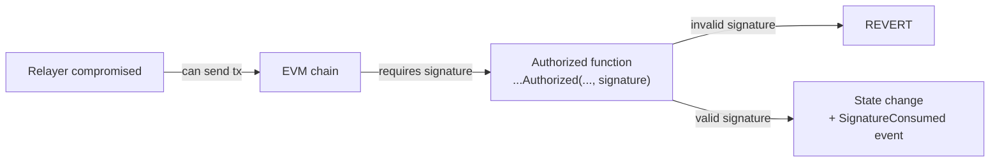

# Threat Model (Draft)

This document describes the **threat model** for the BlackCat Trust Kernel.

Important:
- These contracts are **not audited**.
- The Trust Kernel is a *system*: on-chain contracts + off-chain runtime enforcement (`blackcat-core`) + secure config handling (`blackcat-config`).

Related:
- Flows/diagrams: [SECURITY_FLOWS](SECURITY_FLOWS.md)
- Spec: [SPEC](SPEC.md)
- Policy enforcement: [POLICY_ENFORCEMENT](POLICY_ENFORCEMENT.md)
- Audit checklist: [AUDIT_CHECKLIST](AUDIT_CHECKLIST.md)

## Trust boundaries (high level)

Assumption: the server filesystem is **not** a trust anchor (FTP mistakes, compromised credentials, partial upgrades).

Core principle:
- **On-chain state** is the source of truth for install/upgrade integrity and emergency controls.
- **Off-chain runtime** must refuse unsafe operations if it cannot verify on-chain state (production = fail closed).

## Attacker capability tiers (why this matters)

This threat model distinguishes between three practical tiers:

1. **Filesystem write only** (common in real incidents)
   - attacker can upload/modify files (FTP mistake, compromised credentials, vulnerable plugin),
   - but does *not necessarily* have interactive code execution.
2. **Application RCE / code execution**
   - attacker can execute code in the app process (PHP RCE, deserialization, template injection),
   - can call local services and reach `localhost` resources.
3. **Host root / hypervisor control**
   - attacker controls the OS, containers, or the hosting provider.

The Trust Kernel is strongest in tier (1): **tamper-evident** + fail-closed.
For tier (2) and (3), you need *hardening tiers* (HSM/KMS, process isolation, multi-device approvals).

## Assets to protect

1. Authority custody (root/upgrade/emergency/reporter):
   - signer sets, thresholds, rotation process, and recovery process.
2. On-chain install identity:
   - the correct `InstanceController` address for the installation.
3. Integrity anchors:
   - `activeRoot`, `activeUriHash`, `activePolicyHash`, compatibility roots (if enabled).
4. Runtime config (security-critical):
   - `chain_id`, RPC quorum, contract addresses, fail-closed mode, and outbox/buffer behavior.
   - the pinned “back controller” / PEP policy sources (policy bytes, cache paths, signer requirements).
5. Release trust:
   - official roots in `ReleaseRegistry` and revocations.

## Threat actors (examples)

- Remote attacker with **write access** to the server filesystem (FTP, compromised app user, vulnerable plugin).
- Malicious or compromised **hosting operator** / admin.
- Attacker controlling **one RPC endpoint** (or capable of returning inconsistent/stale data).
- Attacker with access to **relayer** (can submit transactions but must not be able to forge signatures).
- Supply-chain attacker trying to inject modified artifacts at install/upgrade time.
- Key compromise (one device stolen, malware, leaked seed phrase).

## Security goals

1. **Tamper-evident by default**: filesystem modifications become detectable.
2. **Tamper-resistance when hardened**: unsafe writes are blocked in production without valid on-chain authorization.
3. **Multi-device by design**: root/upgrade/emergency actions require multiple devices (Safe or KernelAuthority).
4. **Replay resistance**: signatures cannot be reused across chains/contracts/time or after nonce increments.
5. **Clear emergency behavior**: incident → pause → recover, with explicit audit trail.

## Key threats and mitigations (selected)

| Threat | What happens | Primary mitigation |
|---|---|---|
| Filesystem tamper (code/config) | attacker modifies files or redirects config | runtime verifies on-chain state + pinned config hash via attestations + fail closed |
| “Redirect runtime” attack | attacker changes chain/RPC/controller address | file permission checks + on-chain pinned config hash + locking |
| Malicious release injection | attacker tries to upgrade to untrusted root | `ReleaseRegistry.isTrustedRoot` checks (if enabled) + revocation |
| Active root revoked after deployment | a previously accepted root becomes untrusted | runtime rejects revoked roots + `pauseIfActiveRootUntrusted()` (permissionless bot) |
| Relayer compromise | attacker can submit tx but not sign | relayer paths require valid EIP-712 signature (EOA/EIP-1271) |
| Signature replay | reuse a signature on another chain/contract/time | EIP-712 domain separator + nonce + deadline |
| RPC lies / stale reads | runtime sees inconsistent state | multi-RPC quorum + max-stale + fail closed |
| Chain / RPC outage | cannot read chain state reliably | buffer/outbox + deny security-critical writes + incident escalation thresholds |
| Monitoring silence / stale check-ins | health signal becomes stale or missing | `maxCheckInAgeSec` + `pauseIfStale()` (permissionless bot) + strict prod posture |
| Single key compromise | attacker gets one key | Safe/KernelAuthority threshold; keep emergency keys offline |

## “Localhost-only DB” helps, but doesn’t solve RCE

Designing the database to accept only `localhost` reduces remote network attack surface:
- a remote attacker can’t directly connect to MySQL/Postgres from the internet.

But:
- an attacker with **local code execution** can still reach `localhost`.

So the real security boundary must be:
- secrets and privileged writes are only possible through the policy enforcement layer (“back controller”),
- and that layer fails closed when trust checks fail.

See: [POLICY_ENFORCEMENT](POLICY_ENFORCEMENT.md).

## Attack narrative: filesystem tamper → detection → auto-pause

Expected:
- A compromised filesystem cannot silently change the “accepted” integrity state.
- Production systems deny unsafe writes when observed state does not match on-chain state.

Forbidden:
- “Accepting” a mismatch because a single RPC endpoint responded.
- Overriding trust checks via environment variables in production.

## Attack narrative: RPC compromise (why quorum matters)

Expected:
- Production uses quorum (recommended `2/3`, minimum `2/2`).
- If quorum is lost, the system continues **read-only** (up to `max_stale_sec`) and denies writes.

Forbidden:
- Trusting a single RPC response for security-critical state.

## Attack narrative: relayer compromise (why signatures matter)

Expected:
- Relayer compromise does not grant authority; it only affects availability and transaction ordering.
- Authorities must be signers, never relayers.

## Non-goals (v1)

- Protecting against a full EVM consensus failure / chain rewrite.
- Protecting against “perfect” endpoint capture where an attacker controls *all* RPC endpoints used by the runtime.
- Preventing misuse by an authorized root authority (root authority is ultimately trusted).

## Gaps (v1) and how to cover them (future tiers)

| Gap | Why it matters | Future mitigation direction |
|---|---|---|
| App-level RCE can call internal code paths | policy must not be “optional” | process separation (local daemon), capability gating, HSM/KMS-backed secrets |
| Host root can tamper with everything | chain can’t protect a fully controlled machine | external monitoring + emergency pause + recovery playbooks |
| Chain/RPC outages can cause availability loss | strict fail-closed can stop writes | staged buffer/outbox + controlled max-stale + escalation thresholds |
| Supply-chain compromise before first on-chain verification | attacker ships a bad build | installer verification + signed artifacts + release registry trust gating |

## Security posture: dev vs production

- Development:
  - can run in warn/continue mode to ease iteration,
  - still records incidents and mismatches for visibility.
- Production:
  - fail closed on trust uncertainty,
  - strict runtime config permissions,
  - pin and lock runtime config hashes on-chain,
  - multi-device authorities only (Safe or KernelAuthority).
